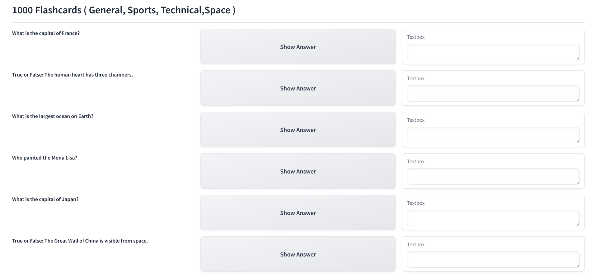

🚀Check out the configuration reference at : https://huggingface.co/docs/hub/spaces-config-reference

🚀Huggingface space : https://huggingface.co/spaces/prithivMLmods/1000-General-Knowledge-Flashcards

🚀The GitHub Model Workspace : 
    
    # Make sure you have git-lfs installed (https://git-lfs.com)
    git lfs install
    
    git clone https://huggingface.co/spaces/prithivMLmods/1000-General-Knowledge-Flashcards
    
    # If you want to clone without large files - just their pointers
    
    GIT_LFS_SKIP_SMUDGE=1 git clone https://huggingface.co/spaces/prithivMLmods/1000-General-Knowledge-Flashcards

## ℹ️Generated Result in Huggingface Spaces:

## 🔮The Flash Card Questions

## 🔮The Flash Card Questions & Caed Results

## Package ( requirements.txt ) 

    Gradio

.

.

.
